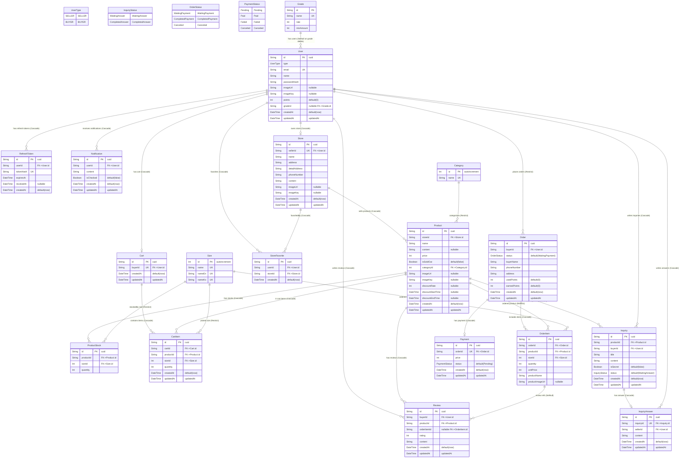

```mermaid
erDiagram

%% =========================
%% ENUMS
%% =========================
UserType {
  SELLER SELLER
  BUYER BUYER
}

InquiryStatus {
  WaitingAnswer WaitingAnswer
  CompletedAnswer CompletedAnswer
}

OrderStatus {
  WaitingPayment WaitingPayment
  CompletedPayment CompletedPayment
  Canceled Canceled
}

PaymentStatus {
  Pending Pending
  Paid Paid
  Failed Failed
  Canceled Canceled
}

%% =========================
%% MODELS (fields included)
%% =========================
Grade {
  String id PK
  String name UK
  Int    rate
  Int    minAmount
}

User {
  String   id PK "cuid"
  UserType type
  String   email UK
  String   name
  String   passwordHash
  String   imageUrl "nullable"
  String   imageKey "nullable"
  Int      points "default(0)"
  String   gradeId "nullable FK->Grade.id"
  DateTime createdAt "default(now)"
  DateTime updatedAt "updatedAt"
}

RefreshToken {
  String   id PK "cuid"
  String   userId "FK->User.id"
  String   tokenHash UK
  DateTime expiresAt
  DateTime revokedAt "nullable"
  DateTime createdAt "default(now)"
}

Notification {
  String   id PK "cuid"
  String   userId "FK->User.id"
  String   content
  Boolean  isChecked "default(false)"
  DateTime createdAt "default(now)"
  DateTime updatedAt "updatedAt"
}

Store {
  String   id PK "cuid"
  String   sellerId UK "FK->User.id"
  String   name
  String   address
  String   detailAddress
  String   phoneNumber
  String   content
  String   imageUrl "nullable"
  String   imageKey "nullable"
  DateTime createdAt "default(now)"
  DateTime updatedAt "updatedAt"
}

Category {
  Int    id PK "autoincrement"
  String name UK
}

Product {
  String   id PK "cuid"
  String   storeId    "FK->Store.id"
  String   name
  String   content "nullable"
  Int      price
  Boolean  isSoldOut "default(false)"
  Int      categoryId "FK->Category.id"
  String   imageUrl "nullable"
  String   imageKey "nullable"
  Int      discountRate "nullable"
  DateTime discountStartTime "nullable"
  DateTime discountEndTime "nullable"
  DateTime createdAt "default(now)"
  DateTime updatedAt "updatedAt"
}

Size {
  Int    id PK "autoincrement"
  String name   UK
  String nameEn UK
  String nameKo UK
}

ProductStock {
  String id PK "cuid"
  String productId "FK->Product.id"
  Int    sizeId    "FK->Size.id"
  Int    quantity
  %% @@unique([productId, sizeId])
}

StoreFavorite {
  String   id PK "cuid"
  String   userId  "FK->User.id"
  String   storeId "FK->Store.id"
  DateTime createdAt "default(now)"
  %% @@unique([userId, storeId])
}

Cart {
  String   id PK "cuid"
  String   buyerId UK "FK->User.id"
  DateTime createdAt "default(now)"
  DateTime updatedAt "updatedAt"
}

CartItem {
  String   id PK "cuid"
  String   cartId    "FK->Cart.id"
  String   productId "FK->Product.id"
  Int      sizeId    "FK->Size.id"
  Int      quantity
  DateTime createdAt "default(now)"
  DateTime updatedAt "updatedAt"
  %% @@unique([cartId, productId, sizeId])
}

Inquiry {
  String        id PK "cuid"
  String        productId "FK->Product.id"
  String        buyerId   "FK->User.id"
  String        title
  String        content
  Boolean       isSecret "default(false)"
  InquiryStatus status "default(WaitingAnswer)"
  DateTime      createdAt "default(now)"
  DateTime      updatedAt "updatedAt"
}

InquiryAnswer {
  String   id PK "cuid"
  String   inquiryId UK "FK->Inquiry.id"
  String   sellerId   "FK->User.id"
  String   content
  DateTime createdAt "default(now)"
  DateTime updatedAt "updatedAt"
}

Order {
  String      id PK "cuid"
  String      buyerId "FK->User.id"
  OrderStatus status "default(WaitingPayment)"
  String      buyerName
  String      phoneNumber
  String      address
  Int         usedPoints "default(0)"
  Int         earnedPoints "default(0)"
  DateTime    createdAt "default(now)"
  DateTime    updatedAt "updatedAt"
}

OrderItem {
  String id PK "cuid"
  String orderId   "FK->Order.id"
  String productId "FK->Product.id"
  Int    sizeId    "FK->Size.id"
  Int    quantity
  Int    unitPrice
  String productName
  String productImageUrl "nullable"
}

Payment {
  String        id PK "cuid"
  String        orderId UK "FK->Order.id"
  Int           price
  PaymentStatus status "default(Pending)"
  DateTime      createdAt "default(now)"
  DateTime      updatedAt "updatedAt"
}

Review {
  String   id PK "cuid"
  String   buyerId     "FK->User.id"
  String   productId   "FK->Product.id"
  String   orderItemId "nullable FK->OrderItem.id"
  Int      rating
  String   content
  DateTime createdAt "default(now)"
  DateTime updatedAt "updatedAt"
  %% @@unique([orderItemId])  (nullable unique)
}

%% =========================
%% RELATIONSHIPS (ONE LINE EACH)
%% =========================

%% Core user edges
Grade ||--o{ User : "has users (SetNull on grade delete)"
User  ||--o{ RefreshToken : "has refresh tokens (Cascade)"
User  ||--o{ Notification : "receives notifications (Cascade)"

%% Store/Product catalog edges
User  ||--o| Store : "owns store (Cascade)"
User  ||--o{ StoreFavorite : "favorites (Cascade)"
Store ||--o{ StoreFavorite : "favoritedBy (Cascade)"
Store ||--o{ Product : "sells products (Cascade)"
Category ||--o{ Product : "categorizes (Restrict)"
Product ||--o{ ProductStock : "has stocks (Cascade)"
Size ||--o{ ProductStock : "stockedBy size (Restrict)"

%% Cart edges
User ||--o| Cart : "has cart (Cascade)"
Cart ||--o{ CartItem : "contains items (Cascade)"
Product ||--o{ CartItem : "in cart items (Cascade)"
Size ||--o{ CartItem : "picked size (Restrict)"

%% Inquiry edges
Product ||--o{ Inquiry : "has inquiries (Cascade)"
User ||--o{ Inquiry : "writes inquiries (Cascade)"
Inquiry ||--o| InquiryAnswer : "has answer (Cascade)"
User ||--o{ InquiryAnswer : "writes answers (Cascade)"

%% Order/Payment/Review edges
User ||--o{ Order : "places orders (Restrict)"
Order ||--o{ OrderItem : "includes items (Cascade)"
Order ||--o| Payment : "has payment (Cascade)"
Product ||--o{ OrderItem : "ordered product (Restrict)"
Size ||--o{ OrderItem : "ordered size (Restrict)"
User ||--o{ Review : "writes reviews (Cascade)"
Product ||--o{ Review : "has reviews (Cascade)"
OrderItem ||--o{ Review : "review refs (SetNull)"
```
